<div align="center">




### ⚡ Backend-Driven Full-Stack Engineer

**Building scalable systems from database to deployment**
_Seeking internships, meaningful projects & ambitious teams_

<p>
  <a href="https://github.com/fuwadog?tab=followers"></a>
  <a href="https://rhean-dev.vercel.app/"></a>
  <a href="https://www.linkedin.com/in/rhean-salibio/"></a>
  <a href="mailto:andrerhean@gmail.com"></a>
</p>


</div>

---

## 🎯 About Me

I architect systems that **scale**. Whether it's designing resilient APIs, optimizing database queries, or orchestrating microservices—I obsess over performance, reliability, and clean code.

**My philosophy:** Production-first. Ship fast. Learn faster.

```typescript
const Developer = {
  role: "Full-Stack Engineer (Backend-Heavy)",
  expertise: {
    backend: [
      "REST APIs",
      "System Design",
      "Database Architecture",
      "Real-time Systems",
    ],
    ai: [
      "LLM Integration",
      "RAG Pipelines",
      "Code Analysis Tools",
      "Provider-Agnostic Solutions",
    ],
    cloud: [
      "Docker",
      "Kubernetes",
      "Cloudflare",
      "Vercel",
      "Cloud Optimization",
    ],
  },
  languages: [
    "TypeScript",
    "Python",
    "Rust",
    "Go",
    "C/C++",
    "Java",
    "C#",
    "JavaScript",
  ],
  seeking: ["Internships", "Open-source", "Co-founder opportunities"],
  response: "24 hours guaranteed",
};
```

---

## 🚀 Featured Projects

### **Timekeeper** — Two Seats, One Scoreboard

A two-player competitive time-tracking web app with live session tracking, gamified scoring, and side-by-side comparisons, built for mutual accountability and friendly competition between exactly two people.

- ✨ **Live session tracking** — Clock in/out with pause/resume, stop and save, and a midnight-to-midnight day timeline
- ✨ **Gamified scoring** — Crown scores, streaks, and archetype badges (Early Bird, Night Owl, Birb)
- ✨ **Side-by-side comparison** — Seven stat rows, dual day timelines, and 35-day activity grids
- ✨ **PWA-ready** — Installable on mobile and desktop with a warm parchment-themed UI

**Stack:** Next.js 16 · Supabase · TypeScript · Tailwind CSS · Drizzle ORM · Zod
**Website:** [time-tracker-ivory-two.vercel.app](https://time-tracker-ivory-two.vercel.app/)
_🔒 This is a private repository. Please contact me for more details about this project._

---

### **Lagunaya Eco-Resort** — Direct-Booking Eco-Resort Platform

A full-stack direct-booking platform for a fictional eco-resort in El Nido, Palawan, featuring an AI-powered concierge named Maya with RAG retrieval and a complete owner CRM.

- ✨ **Zero-commission booking** — 4-step flow with GCash/Maya integration, no third-party cut
- ✨ **AI concierge (Maya)** — Guest-facing chatbot for trip planning plus a Backstage co-worker mode for inbox triage
- ✨ **Owner CRM** — Kanban deal pipeline, dispatch board, lead tracking, and revenue analytics
- ✨ **Type-safe end-to-end** — Strict TypeScript with Zod schemas shared across packages, 213 passing tests

**Stack:** React 18 · TypeScript · Tailwind CSS · Vite · Zustand · Zod
**Website:** [lagunaya-eco-resort-website-web.vercel.app](https://lagunaya-eco-resort-website-web.vercel.app/)
_🔒 This is a private repository. Please contact me for more details about this project._

---

### **Likha Travel** — AI-Powered Travel Booking Platform

A full-stack travel agency platform featuring an AI chat assistant, custom trip builder, booking flow, and a backstage CRM dashboard, all powered by Cerebras LLM with RAG retrieval.

- ✨ **AI chat assistant** — RAG-backed widget that recommends packages with prices and guides an inline booking flow
- ✨ **Custom trip builder** — Multi-step form with fuzzy destination autocomplete, generating downloadable PDF itineraries
- ✨ **Backstage CRM** — Sales pipeline Kanban, revenue KPIs, and supplier briefs auto-sent on deal close
- ✨ **PWA & security** — Offline support, strict CSP headers, rate limiting, and prompt injection protections

**Stack:** Next.js 16 · React 19 · TypeScript · Neon Postgres + pgvector · Cerebras gpt-oss-120b
**Website:** [likha-orcin.vercel.app](https://likha-orcin.vercel.app/)
_🔒 This is a private repository. Please contact me for more details about this project._

---

### **Gemini Chat** — Feature-Rich AI Chat Interface

A multi-conversation AI chat interface powered by Google Gemini models. Users bring their own API key and chat through a modern dashboard with real-time streaming.

- ✨ **Real-time streaming** — SSE-powered responses with a model fallback chain (2.5 Flash → 2.0 Flash)
- ✨ **Multi-conversation management** — Create, switch, and delete chat threads with auto-generated titles
- ✨ **Privacy-first API key handling** — Bring-your-own key stored only in sessionStorage, auto-cleared on tab close
- ✨ **Animated UI** — Splash screen, three-column dashboard, Catppuccin dark/light themes

**Stack:** Next.js 16 · React 19 · TypeScript · Google Gemini API
**GitHub:** [fuwadog/Web_chat](https://github.com/fuwadog/Web_chat)
**Live:** [web-chat-ruddy.vercel.app](https://web-chat-ruddy.vercel.app/)

---

### **ChronoLedger** — Team Timesheets & Tamper-Proof Audit Trail ⚙️ _In Development_

A team time-tracking and timesheet platform for agencies and compliance-conscious teams, built around the append-only audit-trail engine originally proven out in Timekeeper: every entry is provable, not just logged.

- 🔨 **Timesheets & approvals** — submit, review, and approve team timesheets with per-project billable rates
- 🔨 **Immutable audit trail** — every edit preserves the prior version first; a full Original → Edited → Current history behind every entry, so "who changed this and when" is provable, not just logged
- 🔨 **Project budgets & billing** — track estimated vs. actual time per client/project, export timesheets to PDF/CSV/Excel for invoicing
- 🔨 **Built for regulated teams** — tamper-evident logging modeled on the audit-trail expectations legal, consulting, and healthcare teams already answer to

**Stack:** PENDING
_🔒 Private repository, early development. Please contact me for more details about this project._

---

## 💻 Tech Stack

### **Languages**


### **Frontend & Web**


### **Backend & Databases**


### **Cloud, DevOps & Infrastructure**


### **AI Engineering & Agentic Tooling**


### **Tools & Linters**


---

## 📊 GitHub Analytics

<div align="center">


</div>

<div align="center">


</div>

<div align="center">


</div>

<div align="center">


</div>

---

## 🧠 Currently Learning & Exploring

```yaml
Deepening Expertise:
  - 🏗️  Advanced System Design & Distributed Systems
  - 📊 Database Query Optimization & Index Tuning
  - 🐳 Kubernetes Orchestration & Production Deployments
  - 🔗 Vector Databases (Pinecone, Weaviate) & RAG Systems
  - 💰 Token Optimization for LLM Context Windows
  - 🚀 Microservices Patterns & gRPC

Active Exploration:
  - GraphQL API Design
  - Event-Driven Architecture (Kafka, RabbitMQ)
  - WebSocket & Real-time Protocol Optimization
  - SOLID Principles in Practice
  - Machine Learning Ops (MLOps)
```

---

## 💪 Key Strengths

**Production-First Mindset**
Every line of code ships with tests, documentation, and proper error handling. No shortcuts, no technical debt.

**Systems Thinking**
I don't just build features—I design systems. Database optimization, caching strategies, scalability are built in from day one, not bolted on later.

**Quick Ramp-Up**
Can learn new tech stacks in days and contribute meaningfully within weeks. More interested in solving problems than arguing about frameworks.

**Strong Communication**
Clear code reviews, thorough documentation, and mentoring mindset. I believe great engineers make teams better.

**Continuous Growth**
Actively studying distributed systems, database optimization, and advanced CS concepts. Not just chasing frameworks—building depth.

---

## 🤝 Open To Collaboration

<div align="center">

| **Type**             | **Details**                                                |
| -------------------- | ---------------------------------------------------------- |
| 🎓 **Internships**   | Backend-heavy teams, real product work, mentorship culture |
| 🌍 **Open Source**   | Meaningful contributions to production systems             |
| 🚀 **Co-founders**   | Ambitious ideas with product-market fit potential          |
| 💼 **Contract Work** | Short-term projects requiring deep expertise               |

</div>

---

## 📬 Let's Connect

<div align="center">

**Choose your preferred channel:**

| Platform     | Link                                                            |
| ------------ | --------------------------------------------------------------- |
| 💼 LinkedIn  | [/in/rhean-salibio](https://www.linkedin.com/in/rhean-salibio/) |
| 🔗 Portfolio | [rhean-dev.vercel.app](https://rhean-dev.vercel.app/)           |
| 💻 GitHub    | [@fuwadog](https://github.com/fuwadog)                          |
| 📧 Email     | [andrerhean@gmail.com](mailto:andrerhean@gmail.com)             |

**Response time:** ⚡ Within 24 hours

</div>

---

<div align="center">


### **Shipping code. Building systems. Growing exponentially.**

</div>
